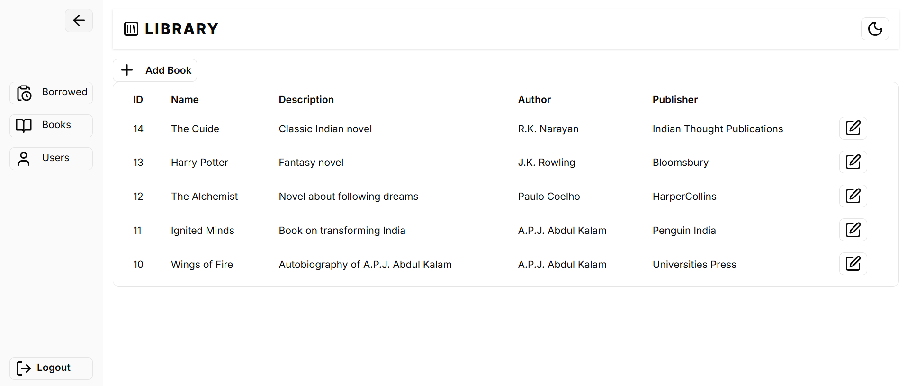
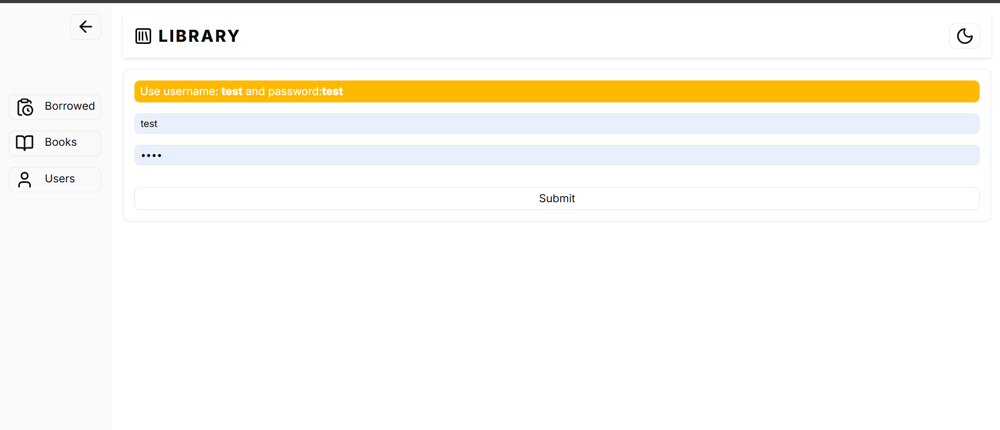
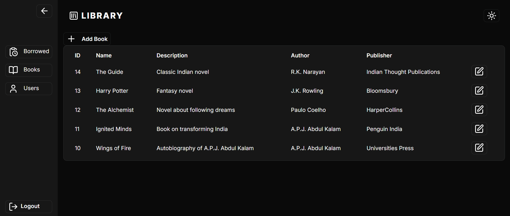
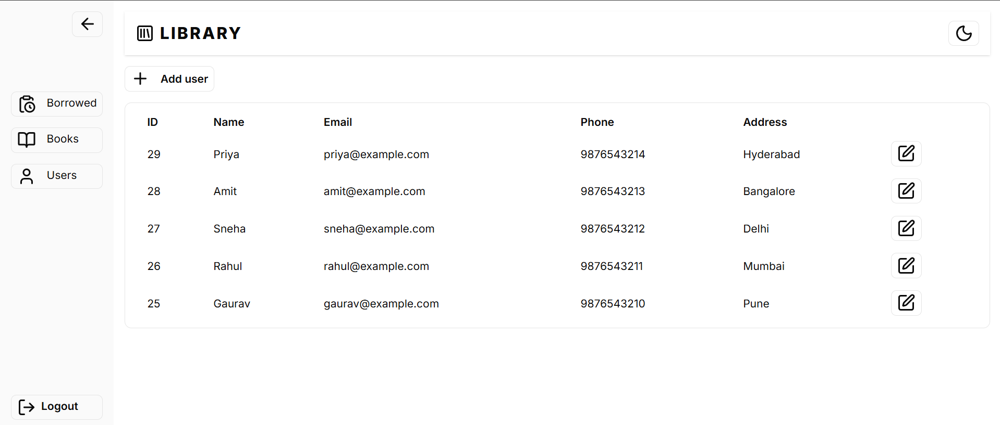
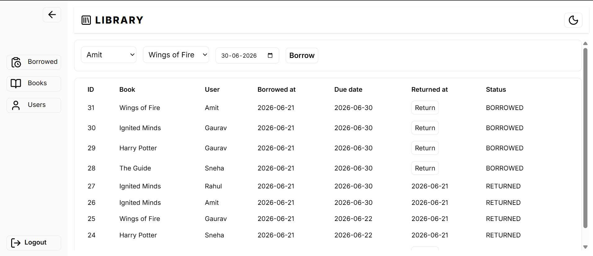

# Neighbourhood Library

A full-stack **Library Management System** built with:

- React + Vite + TypeScript
- FastAPI
- PostgreSQL
- Docker

---

## Preview



---

## Features

- Manage books
- Manage users
- Borrow books
- Return books
- Authentication
- Dark mode support

---

## Tech Stack

### Frontend

- React
- Vite
- TypeScript
- Tailwind CSS

### Backend

- FastAPI
- Python

### Database

- PostgreSQL

### DevOps

- Docker
- Docker Compose

---

## Run with Docker

### Prerequisites

Install:

- Docker
- Docker Compose

---

### Start Application

From project root:

```bash
docker compose up --build
```

---

## Access Application

### Frontend

```text
http://localhost:80
```

### Backend API

```text
http://localhost:8000
```

### PostgreSQL

```text
localhost:5432
```

Database credentials:

```text
DB: library_db
User: postgres
Password: postgres
```

---

## Screenshots

### Login



### Books


### Books (Dark Mode)



### Users



### Borrows



---
